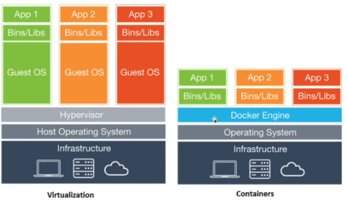
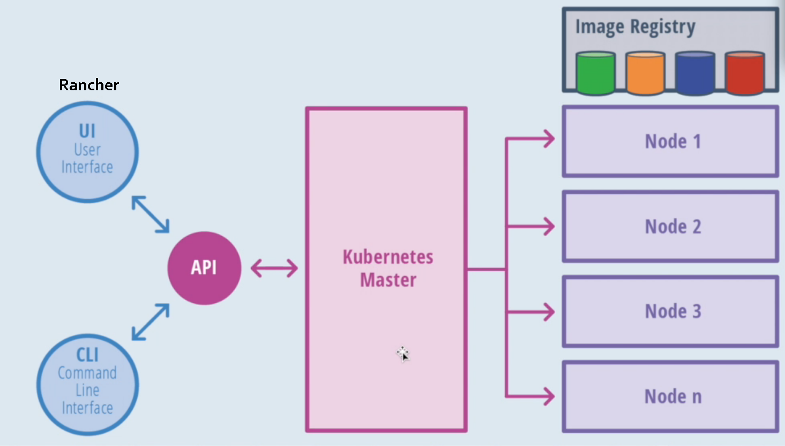
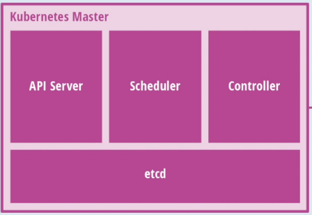
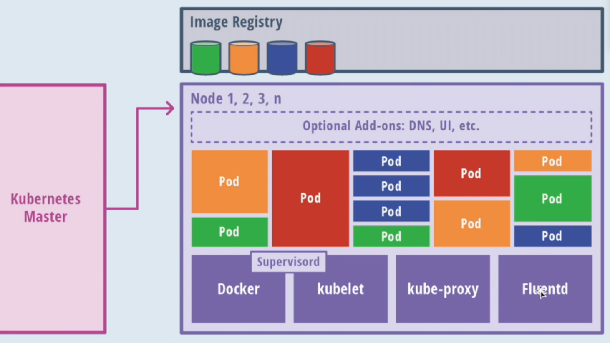

# Kubernetes
## Objetivo dos Containers

Possibilitar ser destruído e recriádo sem comprometer a integridade da aplicação. O container não ficará ativo o tempo todo, pode "morrer" e ser recriado ou mesmo escalar.

## Estrutura do Docker

### Diferença entre Container e Máquina Virtual
Os containers virtualizam o sistema operacional e as maquinas virtuais virtualizam um hardware.

## Por que usar containers?

### Implementação rápida

Inclui requisitos minumos para rodar a aplicação.

### Portabilidade entre maquinas

Um aplicativos e todas as suas dependencias podem ser empacotadas em um unico conteiner  independente da versao do host e do kernel linux, distribuição ou modelo de implantação.

### Controle de versão e reuitilização de componentes

Podemos verificar o nome do container e a tag dele, inspecionar diferenças ou reverter versoes anteriores.

### Imagens otimizadas

Uma imagem deve ter um tamanho reduzido.

### Compartilhamento

Você pode usar um repositório remoto ou local para compartilhar suas imagens.

### Manutenção simplificada

O Docker reduz o esforço e risco de problemas com dependências de aplicativos.

## Rancher

Software open-source que **contém um conjunto de códigos necessários para gerenciamento e orquestração de containers.**

Orquestra e gerencia o kubernetes.

**Realiza o multi-cluster management:**

- Gerencia, faz upgrades, cuida das permissões, monitoramento, faz health check e backup de clusters.

Facilita pois instala clusters kubernetes independente da infraestrutura.

Possibilita que pequenas áreas gerenciem essa infraestrutura.

#### K3S Lightweight Kubernetes

Kubernetes "muito leve", desenvolvido especificamente para dispositivos IOT que possam não ter muitos recursos de infraestrutura.

#### Rancher OS

Sistema operacional único e especificamente para rodar containers da Rancher.
Linux que carrega estritamente componentes para rodar container. Tudo nele são containers.

#### Projeto LongHorn

Projeto para trabalhar com volumes dos container.

## Kubernetes

**Plataforma open-source de gerenciamento de containers de nível enterprise**, baseado em 15 anos de experiência do Google e pronto para o uso multi-cloud. **Possui desenho modular e pode ser rodado em quase qualquer lugar**.

Kubernetes é um resultado da evolução do [Google Borg Large-scale cluster management](https://static.googleusercontent.com/media/research.google.com/pt-BR//pubs/archive/43438.pdf)

**O Kubernetes provê uma arquitetura flexível e com mecanismo desacoplado de service descovery.**

Como a maioria das plataformas computacionais distribuídas, **um cluster consiste:**

- Um **master** e **múltiplos nodes** de computação.

### Arquitetura Kubernetes

- **UI**: Fornecido pelo Rancher
- **CLI**: Command Line Kubectl
- **Kubernetes Master**: Controla os nós. Um cluster com um kubernetes master suporta até 5 mil nós.

### Kubernetes Master

- **etcd** : Banco de dados do container

Responsável pela API, agendamentos dos deployments e gerenciamento total do cluster.

Gerencia os containers, onde estão sendo deployados e a conexão entre eles.

### Nós/Nodes

Os nós são os trabalhadores do Cluster. Eles expõem os serviços, rede e armazenamento para as aplicações.

#### Estrutura dos Nós

Cada nó do cluster roda:

- Container runtime, Docker ou Rocket, com os agentes para se comunicar com o master. ( Kubelet, Kube-proxy )

- Componentes adicionais  para:
  - Logs ( **Fluentd** para coletar os logs )
  - Monitoramento
  - Service Discovery
  - Add-ons opcionais

### Componentes

Os componentes citados a baixo, fazem com que o Kubernetes seja uma excelente escolha para diferentes arquiteturas de aplicações web, aplicações de microserviços altamente distribuídos e até mesmo aplicações batch.

- ### Pods
  Containers que trabalham em conjunto.
- ### Services
  Pods que trabalham em conjunto
- ### Deployments
  Provê uma única declaração para Pods e ReplicaSets.
- ### Labels
  Usado para organizar serviços
- ### Daemonsets
  Rodar sempre um ou mais pods por nó.
- ### Secrets
  Salvar dados sensitivos como senhas de bancos de dados.
- ### ConfigMaps
  Arquivo de configurações que suas aplicações irão usar.
- ### Cron jobs
  Executar tarefas temporais, uma vez ou repetidas vezes.
- ### Deployment de containers e controle de rollback
  Descreve seus containers e quantos você quer com o "Deployment". O Kubernetes irá manter esses containers rodando e irá gerenciar mudanças no deployment ( atualização de imagens ou variáveis de ambiente ) com um "rollout". Possibilita pausar, resumir e fazer rollback das alterações que você preferir.
- ### Empacotamento de recursos
  Permite declarar um mínimo e máximo de recursos computacionais ( CPU e memória ) para seus containers.
- ### Service Discovery e Autoscaling.
  Se um pod morrer em um determinado lugar e for recriado em outro, automaticamente o kubernetes atualiza os DNS(s)
  - O Kubernetes pode expor automaticamente seus containers no cluster.
  - Balanceia automaticamente o tráfego através dos containers.
  - Suporta service discovery através de variáveis de ambiente e DNS.
  - Permite configurar o autoscaling baseado em CPU, Memória e rede para os containers aumentarem seus recursos e utilização.
- ### Cluster Heterogêneo
  Roda em qualquer lugar. Você pode construir seu cluster para um conjunto de VM's rodando em nuvem, on-premisses, ou bare metal dentro do seu data center.
  Permite ter máquinas na Amazon, Google, Azure. 
- ### Armazenamento persistente
  Kubernetes inclui suporte para armazenamento persistente conectado as aplicações stateless. Existe suporte para AWS, EBS, GCP e outros.
- ### HA 
  Escalável para o planeta Terra.

  Multi-master ou Cluster Federation
  - **Cluster Federation:** Permite conectar clusters em conjunto, para permitir que se um cluster caia, os containers podem automaticamente serem movidos para outro cluster.

## Soluções

O Kubernetes nos ajuda a resolver problemas que enfrentamos ao rodar aplicações containerizadas em um ambiente clusterizado, como:

- em um cenário com diversos containers e um cluster com dezenas de máquinas. A complexidade de conectar esses containers de forma correta e segura,gerenciar recursos, acessos e realizar deployments.

Reduz o trabalho da infraestrutura, viabilizando o Devops, onde o desenvolvedor fica responsável pelo código/template do deployment da aplicação e a infraestrutura cuide das máquinas e recursos computacionais.
